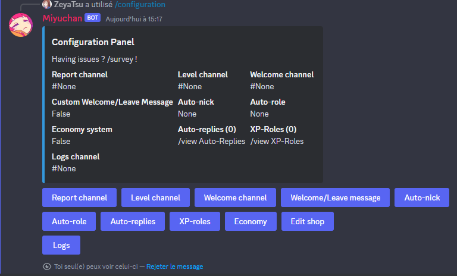

# Configuration
## This is the most important thing if you want to start using Miyuchan correctly.

To start configuring Miyuchan, write `/configuration`,  
if perfectly executed, you should get a message like this:  
  
  
Do as the message says, and you will eventually get a message like this  

> [!NOTE]  
> Only a user with `administrator` permission is able to execute this command.  

### As you can see, the configuration panel provides a lot of features that can be managed, you will find a documentation for each feature right below

* [Report channel](configuration_docs/report.md)
* [Level channel](configuration_docs/level.md)
* [Welcome channel](configuration_docs/welcome.md)
* [Welcome/Leave message](configuration_docs/welcome_leave_message.md)
* [Auto-nick](configuration_docs/autonick.md)
* [Auto-role](configuration_docs/autorole.md)
* [Auto-replies](configuration_docs/autoreplies.md)
* [XP-roles](configuration_docs/xproles.md)
* [Economy](configuration_docs/economy.md)
* [Edit shop](configuration_docs/edit_shop.md)
* [Logs](configuration_docs/logs.md)
