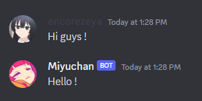

# Auto-Replies
## When a member will start their message by a specific word, the bot will reply.

Set-up the Auto-replies by opening the configuration panel, clicking on `Auto-Replies` and fill in the form  

For example:  

So now when a member will start their message by "Hi":  

> [!NOTE]
> The cases of the word isn't needed to be perfect, for example "Hello !" will work for "Hi", "hI", "HI", "hi".

> [!NOTE]
> You can view the Auto-Replies you have set by doing `/view Auto-Replies`