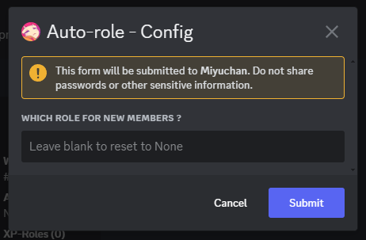
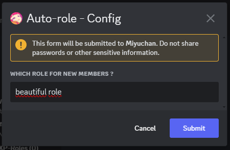

# Auto-Nick
## When a new member joins your server, they will get a role

> [!NOTE]  
> Miyuchan requires the "Manage roles" permission to execute this feature perfectly.  

As you clicked on the button "Auto-role" from the configuration panel, you will get this window:  

In this window you are asked to enter a role-name for new members, if you leave it blank it will just reset it.
For example:

So now with this set, when a new member will join they will get the role `@beautiful role` automatically.