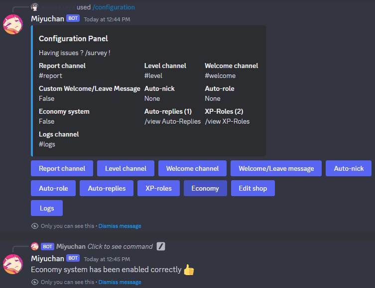
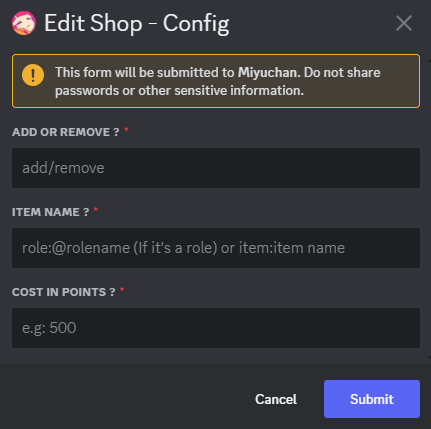
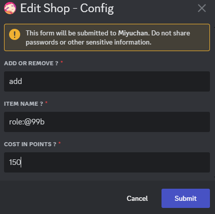
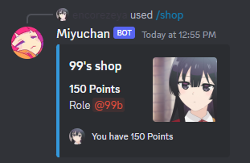

# Economy
## Enable the economy system in your discord server + commands

First, enable the Economy system in the configuration panel by clicking on the feature  

Once enabled, here are the commands that will now work:
* /shop
* /buy
* /inventory
* /drop
* /hourly
* /colors
* /fish
* /points add/remove (for admin)

# Shop editor

As you need to fill your shop with items (and even roles) for an amount of points, you will first need to go back to the configuration panel and click on "Edit shop".  

Once made perfectly, you will end up with a window like this:  

And you can fill as follow (for example):  

So now when doing `/shop`  

