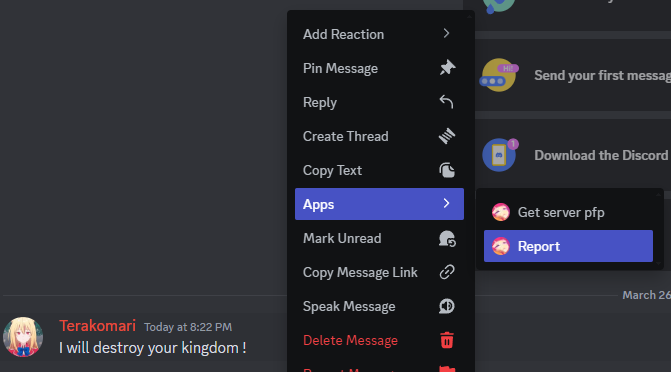
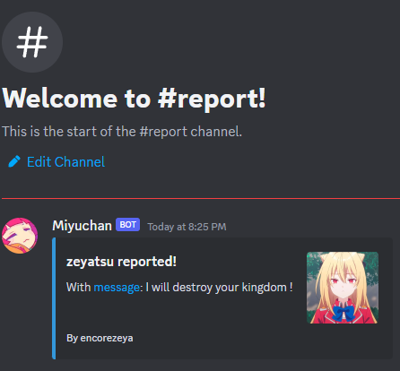

# Report
## A member can report another

> [!NOTE]  
> Requires [logs 'Report channel'](logs.md) to work.

For members from your server wanting to report someone else, they have to right-click on one of their messages, then Apps and 'Report'  

Once reported, you will get a report message in the channel you chose to be the Report channel

