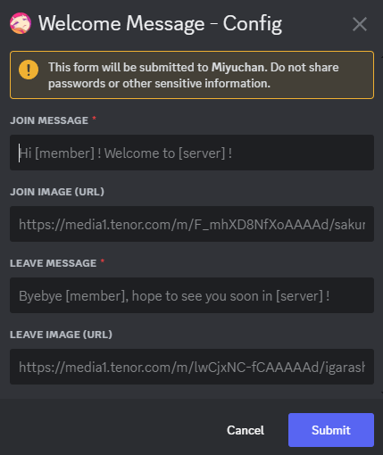
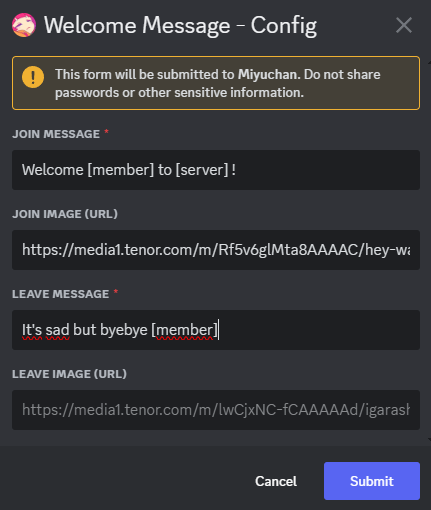
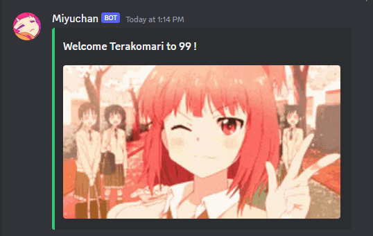
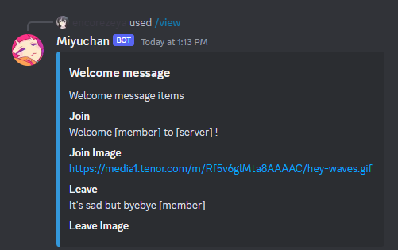

# Welcome join/leave message
## When a new member joins/leaves your server, the welcome/leave message will be sent in the welcome channel.

> [!NOTE]
> Requires `Welcome channel` to be set-up.

Set-up the Welcome channel by opening the configuration panel, clicking on `Welcome/Leave message` and fill in the form

For example:

You can let `JOIN IMAGE (URL)` or/and `LEAVE IMAGE (URL)` blank.  
Once confirmed, when a new member will join/leave your server the bot will send the messages you have prepared

You can also check the options you have set by doing `/view Welcome message`

