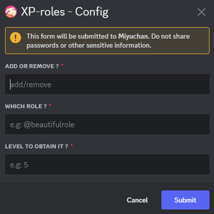
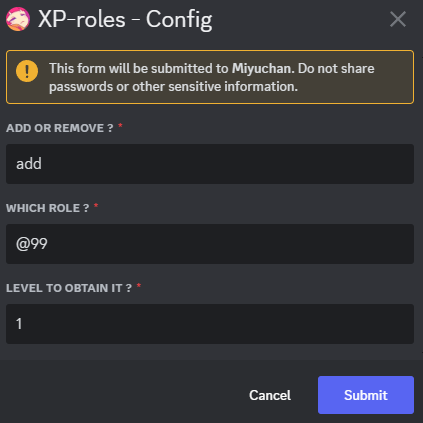

# XP-Roles
## When a member will reach a certain level, they will get a role

Set-up the XP-Roles by opening the configuration panel, clicking on `XP-roles` and fill in the form :

For example:

Now when a member will reach the level 1, they will get the role `@99`

> [!NOTE]
> You can view the XP-roles you have set by doing `/view XP-Roles`