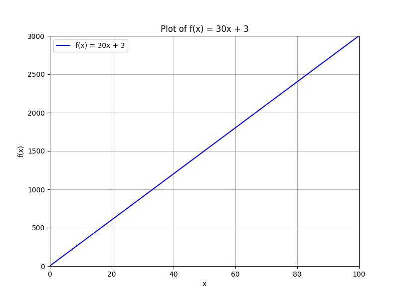
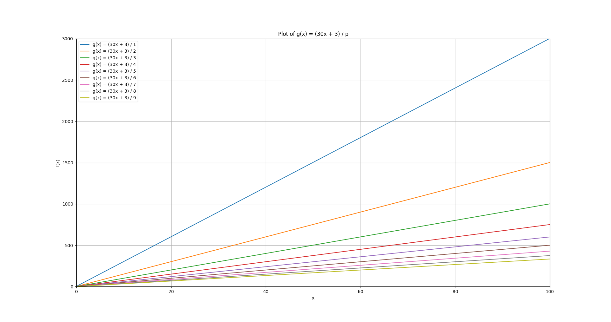
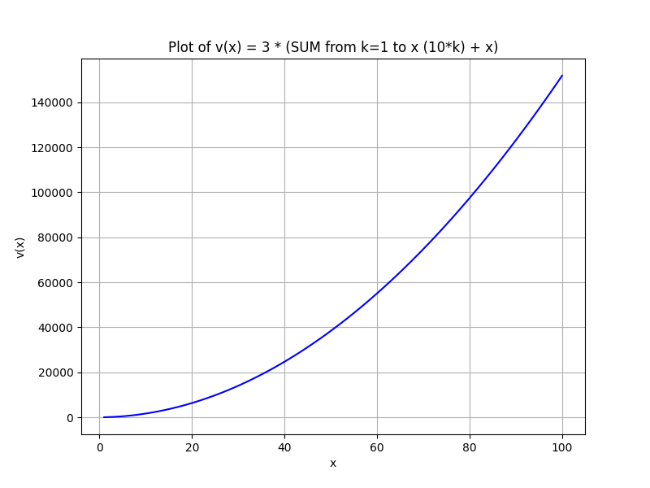
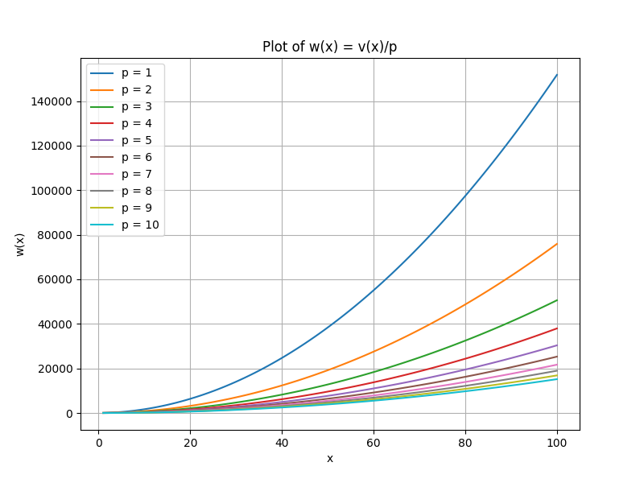

# Levels & XP
## Mostly maths stuff here

### XP Gain
Everytime you send a message in the chat, you gain XPs.
The XPs you gain isn't a constant number, it is a random one between 1 and 10.

### XP needed for next Level (Calc)
The formula in charge of calculating the xp needed for the next level is  
`f(x) = 30x+3` with x your current level  
For example, Level 1 requires 33 xp as `f(1) = 30*1+3 = 33`


Assuming you gain `p` XP for each message you send, we get a new function showing how many messages you have to send to reach that level:  
`g(x) = (30x+3)/p` knowing `p` can be between 1 and 10:
  

Now we can make another function, to know how many xp we have to get in total to reach x level, and another to know how many messages  
  
  
If you want to know for a specific level, here is a code snippet you can try:  
```py
import numpy as np

def v(n):
    return (3 * ((np.arange(1, n+1) * 10).sum() + n))

def w(n, p):
    return v(n)/p

n = 22 # Level to reach
p = 5 # XP for a message (between 1 and 10)

print("Total XP Required to reach this level:",v(n))
print("Total messages to send to reach this level:",int(w(n, p))+1)
```  
Do not forget that it is an approximation as the XP Gain is random between 0 and 10 and so change everytime you send a message.
